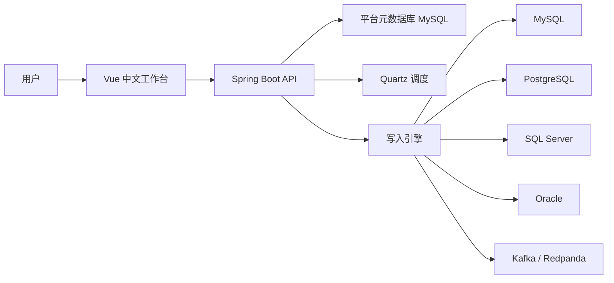

# 多数据源模拟数据生成器

多数据源模拟数据生成器是一个面向测试、联调、演示和压测准备的中文数据生成平台。它的目标很直接：连接目标数据源，按表结构或消息结构生成模拟数据，并把数据真实写入目标端。

很多团队在做接口联调、报表验证、数据链路测试时，都会遇到同一个问题：目标库没有合适的数据，手写 SQL 太慢，复制线上数据又有合规风险，Kafka 这类消息数据还需要维护复杂 JSON 结构。这个项目就是为了解决这类问题而构建的。

平台当前支持 MySQL、PostgreSQL、SQL Server、Oracle 和 Kafka。你可以选择已有表自动读取字段，也可以手动定义新表字段；可以执行一次性写入，也可以开启持续写入或定时写入；可以生成单表数据，也可以生成父子表、父子 Topic 这类有关联关系的数据。

## 项目定位

这个项目不是 BI 平台，也不是数据同步平台。它专注于一件事：根据用户定义的结构和规则，生成可落地、可追踪、可验证的模拟数据。

适合使用它的场景包括：

- 后端接口联调，需要快速准备目标库测试数据。
- 前端演示系统，需要可重复生成的业务样例数据。
- 数据平台验证，需要向 MySQL、PostgreSQL、SQL Server、Oracle 写入结构化数据。
- 消息链路测试，需要向 Kafka 写入普通 JSON 或复杂嵌套 JSON。
- 关系模型验证，需要同时生成父表、子表，并保证外键映射关系。
- 压测前准备，需要持续或周期性向目标端写入数据。

## 核心能力

| 能力 | 说明 |
| --- | --- |
| 数据源连接 | 管理 MySQL、PostgreSQL、SQL Server、Oracle、Kafka 目标连接，支持连接测试、表列表读取、表结构读取。 |
| 单表写入任务 | 选择已有表自动映射字段，或手动输入表名和字段，配置生成规则后写入目标端。 |
| 关系任务 | 支持父子表、父子消息的关联生成，适合订单、用户、明细、事件链路等场景。 |
| Kafka 复杂消息 | 支持示例 JSON 解析、JSON Schema 导入、嵌套结构编辑、Key/Header 配置、路径级映射。 |
| 调度写入 | 支持手动执行、间隔持续写入、Cron 定时写入、指定时间触发。 |
| 执行回溯 | 每次执行都有实例记录，可查看写入前条数、写入后条数、净增条数、校验结果和错误摘要。 |
| 中文工作台 | 前端交互、提示、异常信息和操作路径均面向中文使用场景。 |
| 发布安全 | 生产前端支持 `/api` 代理，后端默认启用 Basic Auth，目标端密码加密存储。 |

## 支持的数据源

| 类型 | 当前支持能力 |
| --- | --- |
| MySQL | 连接测试、表读取、字段读取、单表写入、关系任务、持续写入、定时写入。 |
| PostgreSQL | 连接测试、表读取、字段读取、单表写入、关系任务、持续写入、定时写入。 |
| SQL Server | 连接测试、表读取、字段读取、单表写入、关系任务、持续写入、定时写入。 |
| Oracle | 连接测试、表读取、字段读取、单表写入、关系任务、持续写入、定时写入。 |
| Kafka | 连接测试、Topic 写入、普通 JSON、复杂 JSON、父子 Topic 关系任务、持续写入、定时写入。 |

## 基本使用流程

1. 进入“数据源连接”，创建目标数据源。
2. 点击“测试连接”，确认目标端可访问。
3. 进入“写入任务”，选择目标连接。
4. 选择已有表自动导入字段，或输入新表名并手动添加字段。
5. 为字段配置类型、主键、非空、生成器和生成规则。
6. 设置写入条数、批量大小和调度方式。
7. 点击“立即执行”，或启动持续写入、定时写入。
8. 进入“执行记录”，查看写入前后条数、实际写入条数和校验结果。

关系任务的流程类似，但会先配置父任务、子任务和字段映射。数据库关系任务会按父子顺序写入，JDBC 目标端支持多表事务回滚；Kafka 关系任务会按父子 Topic 写入，并通过字段路径完成关联映射。

## 平台架构



后端负责连接管理、任务定义、数据生成、调度执行、结果记录和安全控制。前端负责把连接、字段、结构、调度和执行结果组织成可视化工作流。平台自身使用 MySQL 保存元数据，目标端可以是数据库，也可以是 Kafka。

## 技术栈

| 模块 | 技术 |
| --- | --- |
| 后端 | Java 21、Spring Boot 3.3.5、Spring Data JPA、Spring Validation、Spring Security、Flyway、Quartz、Kafka Clients |
| 前端 | Vue 3、TypeScript、Vite、Vue Router、Axios、Vitest |
| 平台元数据库 | MySQL 8 |
| 本地依赖 | Docker Compose、PostgreSQL、SQL Server、Oracle Free、Redpanda |

## 快速启动

### 环境要求

- JDK 21
- Node.js 20 及以上
- npm
- Docker 或 Docker Compose
- Windows 环境可以使用 PowerShell，也可以使用 WSL + Docker

### 启动基础依赖

```bash
docker compose up -d mysql postgres redpanda redpanda-init http-echo
```

这会启动平台元数据库、MySQL 目标库、PostgreSQL 目标库、Kafka 兼容服务 Redpanda 和 HTTP 回显服务。

### 启动后端

```bash
cd backend
mvn spring-boot:run
```

默认地址：

| 项目 | 地址 |
| --- | --- |
| 后端 API | `http://127.0.0.1:8888` |
| 健康检查 | `http://127.0.0.1:8888/actuator/health` |
| Swagger | `http://127.0.0.1:8888/swagger-ui.html` |

默认平台元数据库：

| 配置 | 值 |
| --- | --- |
| Host | `127.0.0.1` |
| Port | `3306` |
| Database | `multisource_data_generator` |
| Username | `root` |
| Password | `123456` |

### 启动前端

```bash
cd frontend
npm install
npm run dev
```

默认前端地址：

```text
http://127.0.0.1:5173
```

### 一体化启动

也可以直接用 Docker Compose 启动前后端：

```bash
docker compose up -d mysql postgres redpanda redpanda-init http-echo backend frontend
```

访问地址：

| 项目 | 地址 |
| --- | --- |
| 前端 | `http://127.0.0.1:8080` |
| 后端 | `http://127.0.0.1:8888` |

生产镜像中的前端 Nginx 已配置 `/api/` 代理，会把浏览器发往 `/api` 的请求转发到后端服务。

## 默认登录

后端默认启用 Basic Auth。首次本地启动可以使用：

| 配置 | 默认值 |
| --- | --- |
| 用户名 | `admin` |
| 密码 | `123456` |

生产部署必须修改默认账号密码：

```bash
MDG_SECURITY_USERNAME=your-admin
MDG_SECURITY_PASSWORD=your-strong-password
```

如确实需要关闭认证，可以设置：

```bash
MDG_SECURITY_ENABLED=false
```

不建议在可被外部访问的环境关闭认证。

## 安全说明

平台会保存目标数据源连接信息，因此安全配置是发布前必须处理的部分。

| 配置 | 说明 |
| --- | --- |
| `MDG_SECURITY_ENABLED` | 是否启用后端认证，默认 `true`。 |
| `MDG_SECURITY_USERNAME` | 登录用户名，默认 `admin`。 |
| `MDG_SECURITY_PASSWORD` | 登录密码，默认 `123456`。 |
| `MDG_SECRET_KEY` | 目标数据源密码加密密钥，生产环境必须设置为强随机值。 |

目标数据源密码使用 AES/GCM 加密后入库。历史明文密码仍兼容读取，但新保存的密码会以加密格式存储。生产环境一旦设置 `MDG_SECRET_KEY`，后续不要随意更换，否则已有加密密码将无法解密。

## 本地目标端连接信息

| 目标端 | 默认连接信息 |
| --- | --- |
| MySQL | Host `127.0.0.1`，Port `3306`，Database `demo_sink`，Username `root`，Password `123456` |
| PostgreSQL | Host `127.0.0.1`，Port `5432`，Database `demo_sink`，Username `postgres`，Password `postgres` |
| Kafka / Redpanda | Bootstrap Servers `127.0.0.1:9092` |
| SQL Server | Host `127.0.0.1`，Port `1433`，Username `sa`，Password `MdgSqlServer123!` |
| Oracle | Host `127.0.0.1`，Port `1521`，Service `FREEPDB1`，Username `MDG_DEMO`，Password `MdgDemo123!` |

SQL Server 使用 profile 启动：

```bash
docker compose --profile sqlserver up -d sqlserver
docker exec -i mdg-sqlserver /opt/mssql-tools18/bin/sqlcmd -C -S localhost -U sa -P "MdgSqlServer123!" -i /work/init/01_demo_sink.sql
```

Oracle 使用 Oracle 官方镜像，首次拉取前需要登录 Oracle 容器仓库：

```bash
docker login container-registry.oracle.com
docker compose --profile oracle up -d oracle
```

## 字段生成器

| 生成器 | 用途 |
| --- | --- |
| `SEQUENCE` | 递增序列，常用于主键、编码。 |
| `RANDOM_INT` | 随机整数。 |
| `RANDOM_DECIMAL` | 随机小数，支持精度和范围。 |
| `STRING` | 随机字符串，支持长度和字符集。 |
| `ENUM` | 枚举值随机选择。 |
| `BOOLEAN` | 布尔值，支持 true 比例。 |
| `DATETIME` | 日期时间，DATE 字段会默认按日期格式生成。 |
| `UUID` | UUID 字符串。 |

已有表模式下，平台会读取字段名称、字段类型、主键、非空等信息，并自动给出默认生成规则。用户可以在保存前修改这些规则。

## 执行结果

每次任务执行都会生成实例记录。平台会尽量返回可验证的写入结果，而不是只返回“提交成功”。

数据库写入会记录：

- 写入前条数。
- 写入后条数。
- 净增条数。
- 实际写入条数。
- 非空字段校验结果。
- 空字符串校验结果。
- 错误摘要。

关系任务会额外记录：

- 每张表或每个 Topic 的执行状态。
- 父子关系映射校验结果。
- 外键缺失统计。
- 主键重复统计。
- JDBC 多表事务是否回滚。

持续写入和定时任务可以通过执行实例列表持续观察结果。

## Kafka 复杂 JSON

Kafka 写入支持两种方式：

| 方式 | 说明 |
| --- | --- |
| 简单字段模式 | 像配置表字段一样配置 Kafka 消息字段，平台生成扁平 JSON。 |
| 复杂结构模式 | 导入示例 JSON 或 JSON Schema，平台解析成可编辑的嵌套消息结构。 |

复杂结构模式适合生成订单事件、用户行为事件、设备遥测数据、风控事件等多层 JSON。平台支持对象、数组、标量字段，并支持通过字段路径配置 Kafka Key、Header 和父子 Topic 映射。

## 目录结构

```text
backend/                     后端服务
frontend/                    前端工作台
infra/mysql/                 MySQL 初始化脚本
infra/postgres/              PostgreSQL 初始化脚本
infra/sqlserver/             SQL Server 初始化脚本
infra/oracle/                Oracle 初始化脚本
scripts/                     启动、联调、冒烟脚本
docs/                        操作文档与联调文档
docker-compose.yml           本地依赖与一体化启动配置
DESIGN.md                    设计约束与界面原则
LICENSE                      Apache License 2.0
```

## 常用命令

后端测试：

```bash
cd backend
mvn test
```

后端打包：

```bash
cd backend
mvn -DskipTests package
```

前端测试：

```bash
cd frontend
npm run test:run
```

前端构建：

```bash
cd frontend
npm run build
```

真实目标端冒烟脚本：

```powershell
powershell -ExecutionPolicy Bypass -File scripts/smoke-write-target.ps1
```

## 当前验证状态

最近一次本地验证结果：

| 项目 | 结果 |
| --- | --- |
| 后端自动化测试 | 118 个测试通过，0 失败。 |
| 前端自动化测试 | 8 个测试文件、59 个测试通过。 |
| 后端打包 | `mvn -DskipTests package` 通过。 |
| 前端生产构建 | `npm run build` 通过。 |
| 静态差异检查 | `git diff --check` 通过。 |

仓库同时提供 MySQL、PostgreSQL、SQL Server、Oracle、Kafka 的本地联调环境和冒烟脚本，便于在发布前对真实目标端执行写入验证。

## 相关文档

| 文档 | 说明 |
| --- | --- |
| `docs/平台操作手册.md` | 面向使用者的操作说明。 |
| `docs/目标数据库联调指南.md` | MySQL、PostgreSQL、SQL Server、Oracle 联调说明。 |
| `docs/Kafka复杂消息API验收说明.md` | Kafka 复杂 JSON 能力说明和验收记录。 |
| `docs/test-report-2026-04-22.md` | 历史测试报告。 |
| `DESIGN.md` | 页面设计原则和交互约束。 |

## 路线图

后续可以优先扩展以下方向：

- 增加 ClickHouse、MongoDB、Redis、Elasticsearch、Doris、StarRocks 等目标端。
- 增加更贴近业务语义的字段生成器，例如手机号、身份证、地址、商品、订单、设备、日志。
- 增加任务模板市场，让常见业务场景可以一键创建。
- 增强执行监控，提供写入速率、失败率、持续任务趋势图。
- 增加更细粒度的权限控制，例如只读用户、执行用户、管理员。
- 增加导入导出能力，方便在不同环境迁移连接和任务配置。

## License

本项目基于 Apache License 2.0 发布。
