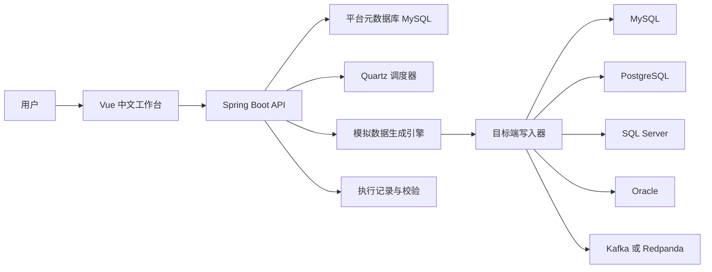
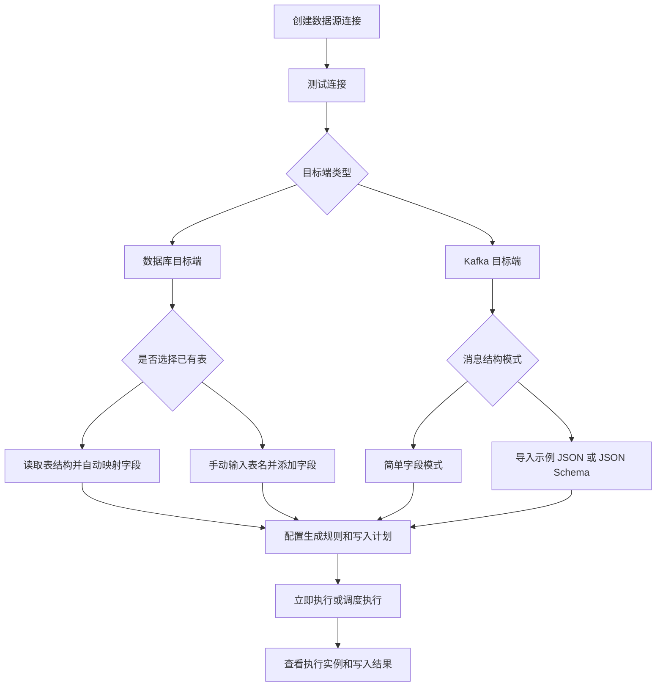
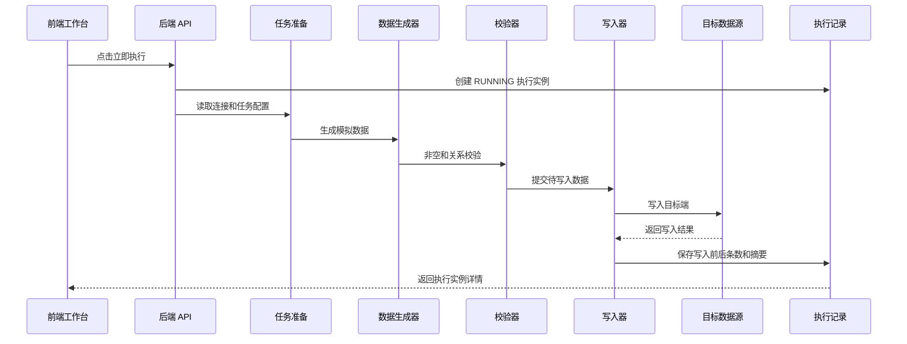
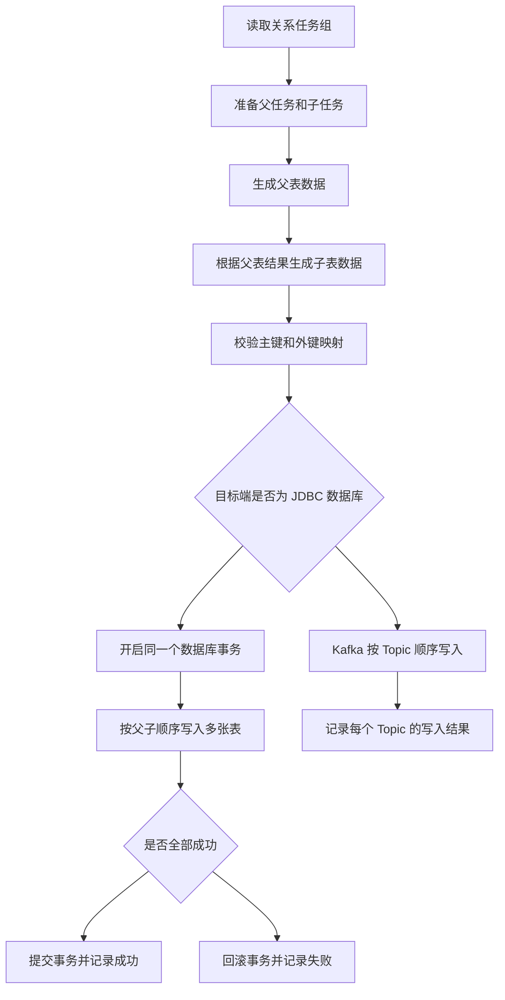
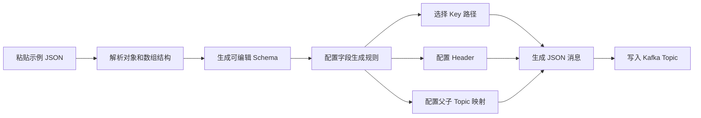
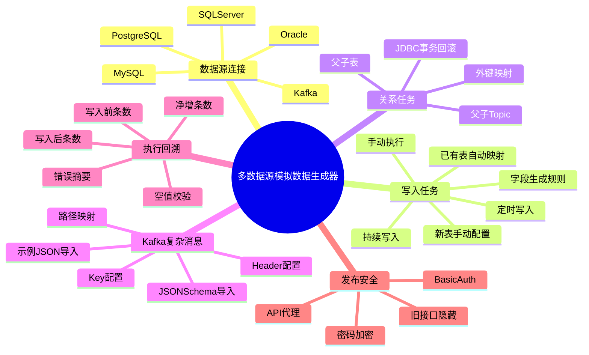

# 我终于把测试数据这件小破事，做成了一个平台

事情是这样的。

这段时间我一直在折腾一个项目，名字很直白，叫多数据源模拟数据生成器。

听起来像一个很工程化、很不起眼的小工具。

但我越做越觉得，这玩意其实挺有代表性的。

因为几乎所有做系统的人，都会遇到一个特别烦的问题。

不是模型不够先进。

不是架构不够优雅。

甚至不是代码写不出来。

而是测试环境里，根本没有一批像样的数据。

你要联调一个订单接口，库里没有订单。

你要验证一个报表，目标表里只有三条演示记录。

你要测一个消息链路，Kafka 里没有复杂事件。

你要压测一个写入流程，手动 insert 了半天，发现主外键还对不上。

这种问题很小。

小到很多团队不会专门为它立项。

但它又很烦。

烦到每次联调、演示、上线前验证，都会被它拖一下后腿。

我自己在做这个系统的时候，脑子里一直有一个特别明确的目标。

能不能让一个人打开平台，连上一个目标数据源，选一张表，填一下要写多少条，然后点执行，数据就真实写进去了。

如果没有表，也可以自己输入表名和字段。

如果不是数据库，而是 Kafka，也可以直接给一段复杂 JSON，让系统解析出结构，然后源源不断地往 Topic 里写消息。

如果是父子表，有主外键关系，也不要让我手搓 SQL。

平台自己把父数据、子数据、关系字段、执行顺序都处理掉。

就这么简单。

说真的，这个需求一点都不性感。

但越是不性感的东西，越容易长期存在。

后来我们把它做成了一个中文工作台。

支持 MySQL、PostgreSQL、SQL Server、Oracle、Kafka。

支持单表写入，也支持父子关系任务。

支持手动执行、周期执行、持续写入。

支持写入前条数、写入后条数、净增条数、非空校验、错误摘要。

还补了认证、密码加密、生产 Nginx 代理这些上线前必须处理的东西。

这篇文章，就把这个平台完整讲一下。

不是发布会式的介绍。

就当我把这段时间踩过的坑、最终形成的设计，认真摊开聊一遍。

先放一张整体架构图。

你看这个架构，其实没有故意搞复杂。

前端就是一个中文工作台。

后端负责连接管理、任务保存、数据生成、调度执行和写入结果记录。

平台自己的元数据放在 MySQL。

真正被写入的目标端，可以是 MySQL、PostgreSQL、SQL Server、Oracle，也可以是 Kafka。

这个设计里，我觉得最重要的不是技术选型。

而是边界。

它不是数据同步平台。

不是 ETL。

不是 BI。

它只做一件事，按照你定义的结构和规则，生成模拟数据，然后写入目标端。

把这件事做顺，就已经能解决大量测试环境里的真实问题了。

很多系统的问题不是缺一个更大的平台。

而是缺一个能把小流程走通的工具。

回到使用体验这块，平台的主流程长这样。

这张图基本就是我心里最理想的操作路径。

第一步，创建数据源连接。

第二步，测试连接。

第三步，选表或者定义结构。

第四步，配置生成规则。

第五步，执行。

第六步，看结果。

这个顺序听起来像废话，但实际做系统的时候，非常容易跑偏。

比如一开始我们也做过很多模板。

用户可以选择订单模板、用户模板、日志模板。

看起来很完整。

但真正用起来，会有一个问题。

用户不是想生成你预设的订单表。

用户是想往他自己的那张表里写数据。

他的字段名可能叫 user_id，也可能叫 member_code，也可能叫 CUSTOMER_NO。

他的数据库里已经有表结构了。

他不需要你给他一堆花里胡哨的模板。

他需要的是，连上库，选中表，字段自动出现，然后他改几项规则，直接执行。

这就是后来平台重构的核心方向。

尽可能让用户选择，而不是填写。

能从目标端读取的，就不要让用户手输。

能自动推断的，就先给默认值。

能在执行后反馈的，就不要只返回一句提交成功。

我一直觉得，工具好不好用，很多时候不是看功能数量。

而是看它有没有替你少做那些无意义的动作。

比如 DATE 字段。

数据库里是 DATE，前端如果默认给它一个 DATETIME 生成器，生成出来是带时间的 ISO 字符串，后端再严格按 yyyy-MM-dd 解析。

结果就是，用户什么都没做错，执行失败了。

这种问题非常烦。

因为它不是大 bug。

但用户会觉得，这系统不靠谱。

所以现在的处理是，已有表里的 DATE 字段会默认生成 dateOnly 配置，后端也兼容日期、时间、ISO Instant 等多种输入。

用户不需要知道这些细节。

他只会感觉，这次怎么就顺了。

顺，才是工具最大的价值。

再说写入执行这块。

以前很多系统喜欢执行后弹一句，任务已提交。

我现在越来越不喜欢这个说法。

提交了，然后呢？

写进去了吗？

写了几条？

目标表原来多少条？

写完之后多少条？

有没有空值？

有没有子表外键对不上？

这些问题不回答，任务已提交这四个字，其实没什么信息量。

所以这个平台的执行链路是这样设计的。

这里有两个点我觉得很关键。

一个是执行实例要尽早创建。

因为长任务跑起来之后，如果执行记录还没提交，前端刷新不到，就会出现一个很尴尬的状态。

用户点了执行，页面说提交了，但执行列表里什么都没有。

他不知道是网络卡了，还是后端挂了，还是任务真的在跑。

所以现在单表任务和关系任务都会先创建 RUNNING 实例，再进入生成和写入。

生成阶段失败，也会留下失败实例。

这对排错非常重要。

另一个是写入结果要尽量具体。

数据库写入会记录 beforeWriteRowCount、afterWriteRowCount、rowDelta、writtenRowCount。

关系任务还会记录每张表的状态、外键缺失、主键重复、空值和空字符串。

Kafka 没有表行数这种概念，就记录 Topic、写入消息数、Key、Header 和执行摘要。

你不是只知道它失败了。

你要知道它失败在哪里。

说到关系任务，这块其实是整个平台里最容易低估的部分。

很多模拟数据工具能生成一张表。

但业务系统里最常见的，从来不是一张孤立的表。

是用户和订单。

是订单和订单明细。

是设备和设备事件。

是父 Topic 和子 Topic。

一旦有关系，事情就复杂了。

因为你不能先写子表。

你不能让子表的 customer_id 指向一个不存在的 customer。

你也不能父表写成功了，子表失败了，然后留下半截脏数据。

数据库关系任务现在的流程是这样的。

这里最重要的是事务。

关系任务如果是 JDBC 数据库目标端，会用同一个目标库连接开启事务。

父表、子表都写成功，才 commit。

中间任何一张表失败，就 rollback。

这件事听起来也像常识。

但很多时候，系统里所谓的关系任务，只是循环调用单表写入。

父表一个连接，子表一个连接。

父表写完已经提交了。

子表失败以后，只能告诉你失败，但没法把父表撤回来。

结果目标库里留下半成品。

这种半成品，在测试环境里最可怕。

因为它不像异常那么显眼。

它会悄悄污染你后面的测试。

你以为是在测新逻辑，其实是在被旧脏数据折磨。

Kafka 的关系任务又是另一种思路。

Kafka 没有数据库事务，也没有表结构。

它的关系靠消息结构里的字段路径维持。

所以我们给 Kafka 做了复杂 JSON 结构能力。

你可以贴一段示例 JSON。

系统解析出对象、数组、字符串、数字、布尔值、时间等字段。

然后你可以选择哪些路径作为 Key，哪些路径进入 Header，哪些路径用于父子 Topic 映射。

流程大概是这样。

这个能力看起来有点细，但实际很有用。

因为现在很多系统的核心数据，已经不只在数据库里了。

订单创建是一条消息。

支付成功是一条消息。

设备上报是一条消息。

用户行为也是一条消息。

而且这些消息很少是扁平结构。

它们通常是嵌套对象里面套数组，数组里面又有对象。

你如果让用户一个字段一个字段手填，体验会非常痛苦。

直接贴一段 JSON，让系统先解析出结构，再让用户微调规则，这才是更自然的方式。

我自己在做这块的时候，有个感受挺强。

很多后台系统不好用，不是因为后端能力不行。

而是因为它要求用户用系统的语言思考。

系统说，你先配置字段类型。

系统说，你先创建 Schema 节点。

系统说，你先定义路径。

但用户脑子里不是这么想的。

用户脑子里想的是，我这里有一段订单事件，你帮我照着这个结构造一批。

所以平台要尽量贴近用户原本的思考方式。

这也是为什么整个系统后来收敛成三个主页面。

数据源连接。

写入任务。

执行记录。

关系任务算一个增强入口，但说到底还是围绕写入。

用户不是来研究平台结构的。

用户是来把数据写进去的。

这话听着简单，但做界面的时候真的很容易忘。

一开始我们也把任务列表、新建表单、执行详情放在一个页面里。

功能都在，但页面非常挤。

用户点最下面的任务，还要往上滚看详情。

字段一多，表单就开始对不齐。

Kafka 一复杂，页面直接变成一坨。

后来我们把数据源连接、写入任务、执行记录都改成更清晰的列表和详情分离。

新建任务单独进入页面。

执行记录也能从任务直接跳转过去。

这不是多高级的设计。

但它符合一个很朴素的原则。

不要让不同目的的内容在同一块空间里互相挤压。

尤其是企业工具，很多时候丑不是因为颜色丑。

是信息层级乱。

用户眼睛不知道先看哪里。

再聊一个上线前绕不开的问题，安全。

这个平台能写目标库，能删任务，能执行持续写入。

如果裸奔上线，那就很危险。

所以现在后端默认启用 Basic Auth。

默认本地账号是 admin 和 123456。

生产环境必须改。

前端顶部有登录状态，接口请求会带 Authorization。

目标端密码也不再明文入库，而是通过 AES/GCM 加密后保存。

这里有个小细节，历史明文密码仍然兼容读取。

因为真实项目里，迁移不能只考虑新数据。

你要给旧数据留一条可走的路。

另外生产前端的 Nginx 也补了 `/api/` 代理。

否则 Docker Compose 启动后，浏览器访问 8080，前端请求 `/api` 会直接打到前端 Nginx。

结果就是 404 或 Network Error。

这种问题特别典型。

开发环境一切正常。

一到生产镜像就炸。

排查下来发现不是业务问题，是代理没配。

大时代啊，朋友们。

很多系统上线前临门一脚倒下的地方，不是算法，不是架构，是 Nginx。

如果把整个系统压缩成一张能力地图，大概是这样。

我知道这不是一个能让人一眼惊呼未来已来的项目。

它没有聊天机器人。

没有多模态。

没有 Agent 自动规划。

它甚至有点土。

连接数据库，配置字段，生成数据，写进去。

但我现在反而越来越喜欢这种土。

因为工程世界里有大量真正有价值的东西，就是这样朴素。

它不负责制造幻觉。

它负责把一条链路打通。

你点一次执行，它就真的往目标端写数据。

你跑一个关系任务，它就真的处理父子关系。

你打开执行记录，它就告诉你写入前多少条，写入后多少条，有没有校验问题。

这就够了。

很多时候，我们不缺一个宏大的概念。

我们缺的是一个能把流程跑完的工具。

当然，这个平台现在也不是终点。

后面还能继续加更多目标端。

ClickHouse、MongoDB、Redis、Elasticsearch、Doris、StarRocks，都可以做。

字段生成器也还能继续增强。

手机号、身份证、地址、商品、订单、设备、日志，这些都可以变成更贴近业务语义的生成器。

权限也可以继续细分。

比如只读用户、执行用户、管理员。

执行监控也可以继续做。

比如写入速率、失败率、持续任务趋势图。

但这些都不是最核心的。

最核心的还是那句话。

让用户连接到某个数据源，指定表名和字段规则，然后把模拟数据真实写进去。

这件事只要足够顺，平台就有价值。

如果你也做过测试环境、联调环境、演示环境，你应该能理解这种感觉。

有时候一个需求不是因为宏大才重要。

它重要，是因为它每天都在发生。

每天都有人在手写 SQL。

每天都有人在改测试数据。

每天都有人在问，Kafka 里有没有一条像样的订单事件。

每天都有人在演示前十分钟，发现目标表是空的。

我做这个平台，某种程度上就是想把这些小麻烦收起来。

让测试数据这件事，从到处救火，变成一个稳定的按钮。

点一下。

数据就来了。

我觉得这就挺好。

以上，既然看到这里了，如果觉得不错，随手点个赞、在看、转发三连吧，如果想第一时间收到推送，也可以给我个星标。

谢谢你看我的文章，我们，下次再见。

> 配图说明，文中的 Mermaid 图可以直接复制到 Mermaid Live Editor、语雀、飞书文档、GitHub Markdown 或支持 Mermaid 的编辑器里渲染成图片。公众号发布时建议导出 PNG 后替换代码块。
